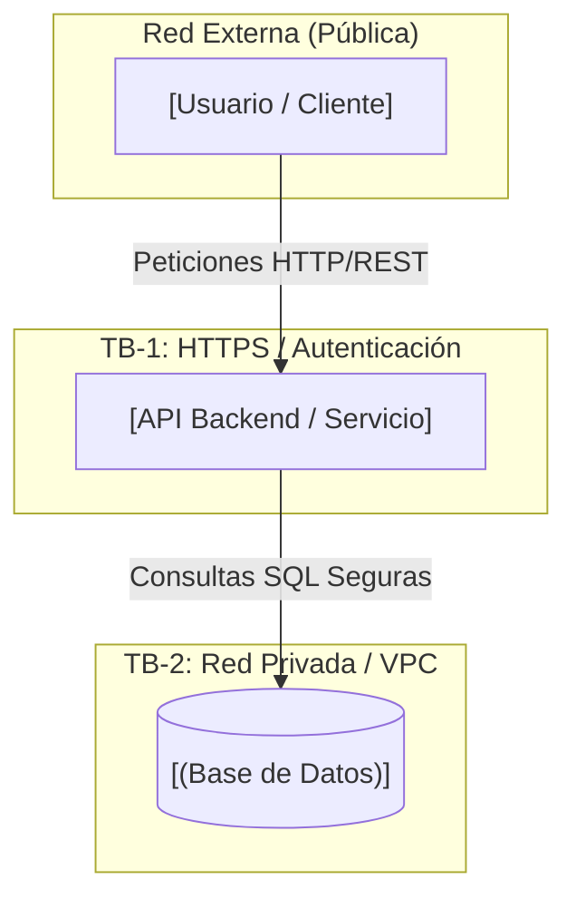

Conversación con Gemini

Required status checks cannot be empty. Please add at least one status check or disable the rule.

la practica que tengo que hacer me dise esto: Require status checks to pass before merging: (Se usará más adelante para automatizar pruebas, pero deben dejarlo mapeado)

Este error ocurre porque activaste la casilla "Require status checks to pass before merging", pero la lista de pruebas asociadas está vacía. GitHub no permite guardar la regla sin seleccionar al menos un chequeo, y si aún no has ejecutado ningún flujo de CI/CD (como GitHub Actions), no habrá ninguna opción disponible para seleccionar.

Para solucionarlo y cumplir con tu práctica, elige una de las siguientes opciones según la fase en la que estés:

Opción 1: Crear un flujo de trabajo básico (Si necesitas dejar la regla activa ya)

    En tu repositorio, crea la carpeta .github/workflows/ y dentro un archivo llamado ci.yml.

    Agrega una acción mínima como esta para registrar un estado:

YAML

name: CI
on: [push, pull_request]
jobs:
  test:
    runs-on: ubuntu-latest
    steps:
      - uses: actions/checkout@v4
      - run: echo "Prueba inicial mapeada"

    Guarda y sube los cambios (git push).

    Ve a la configuración de la rama en GitHub, busca "Require status checks to pass before merging", escribe test en la barra de búsqueda que aparece abajo, selecciónalo y guarda los cambios.

Opción 2: Desactivar la casilla por ahora (Si aún no van a subir código)

    Si la práctica dice que la automatización de pruebas se usará más adelante, desmarca temporalmente la casilla Require status checks to pass before merging.

    Configura el resto de las reglas de la rama (como requerir Pull Requests o revisiones) y guarda.

    Vuelve a activar esta casilla únicamente cuando hayas subido el archivo de pruebas en los siguientes pasos de la práctica.

desde web

Puedes realizar todo el proceso directamente desde la interfaz web de GitHub sin usar la terminal:

Opción A: Crear el archivo del flujo de pruebas directamente en la web

    Ve a la pestaña Code de tu repositorio.

    Haz clic en el botón Add file (arriba a la derecha) y selecciona Create new file.

    En la casilla para nombrar el archivo, escribe exactamente .github/workflows/ci.yml (al escribir las barras /, GitHub creará las carpetas automáticamente).

    En el editor de texto, pega este código:

YAML

name: CI
on: [push, pull_request]
jobs:
  test:
    runs-on: ubuntu-latest
    steps:
      - run: echo "Prueba mapeada"

    Haz clic en el botón verde Commit changes... y confirma dando clic de nuevo en Commit changes.

    Ve a Settings > Branches y edita tu regla de protección.

    En la regla Require status checks to pass before merging, escribe test en la barra de búsqueda que aparece abajo, selecciona la opción que se despliega y guarda los cambios.

Opción B: Desactivar la casilla temporalmente desde la web

    Ve a la pestaña Settings en la parte superior de tu repositorio.

    En el menú lateral izquierdo, haz clic en Branches.

    Ubica la regla de tu rama y haz clic en Edit.

    Desmarca la casilla Require status checks to pass before merging.

    Desplázate al final de la página y haz clic en Save changes.


Require branches to be up to date before merging: Whether

pull requests targeting a matching branch must be tested with the

latest code. This setting will not take effect unless at least one

status check is enabled.


esto pone github

Ese mensaje es un aviso informativo de GitHub: te indica que la opción para exigir que la rama esté actualizada solo funciona si ya existe al menos un chequeo de estado (status check) activo en el repositorio.

Como tu práctica indica que el chequeo de pruebas se usará más adelante, puedes omitir la casilla por ahora para guardar la regla sin errores desde la interfaz web.
1
Desmarcar el chequeo de estado
Paso 1

En la pantalla de configuración de la regla, desmarca la casilla Require status checks to pass before merging.
2
Guardar la regla
Paso 2

Desplázate hasta el fondo de la página y haz clic en el botón Save changes (o Create si es la primera vez).
3
Verificar la regla guardada
Paso 3

Revisa el listado de reglas para confirmar que la protección de rama haya quedado registrada.

Para verificar que el paso fue exitoso, la página no te mostrará ningún mensaje de error en rojo y la regla aparecerá visible en la lista de la sección Settings > Branches.

Si tu profesor requiere estrictamente que la casilla quede marcada desde ahora, necesitarás subir primero un archivo de prueba al repositorio para que GitHub reconozca un chequeo de estado.

¿Cómo creo el archivo de pruebas CI desde la web para activar la casilla ya mismo?

Crear el archivo de pruebas directamente en GitHub habilitará la pestaña Actions y generará el chequeo necesario para la regla de protección de tu rama.
1
Crear el archivo en el repositorio
Paso 1

En la pestaña Code de tu repositorio, haz clic en el botón Add file (arriba a la derecha) y selecciona Create new file.
2
Asignar la ruta y nombre
Paso 2

En el campo para nombrar el archivo, escribe exactamente .github/workflows/ci.yml. Al escribir las diagonales /, GitHub creará la estructura de carpetas automáticamente.
3
Pegar la configuración del flujo
Paso 3

Copia y pega este código dentro del editor:
YAML

name: CI
on: [push, pull_request]
jobs:
  test:
    runs-on: ubuntu-latest
    steps:
      - run: echo "Prueba iniciada"

4
Guardar los cambios (Commit)
Paso 4

Haz clic en el botón verde Commit changes... (arriba a la derecha) y confirma haciendo clic de nuevo en Commit changes (manteniendo seleccionada la rama principal).
5
Vincular el chequeo en la regla
Paso 5

Ve a Settings > Branches, edita la regla de protección, marca Require status checks to pass before merging, escribe test en la barra de búsqueda que aparece justo abajo, selecciona la opción que despliega y haz clic en Save changes.

Para verificar que este paso fue exitoso, ve a la pestaña Actions en la parte superior del repositorio: verás un trabajo de CI ejecutándose y finalizando con un ícono de verificación verde (✔️). Al terminar, la opción test estará lista para elegirse en las reglas de tu rama.

Your rulesets won't be enforced on this private repository until you move to GitHub Team organization account.

Este mensaje aparece porque GitHub no permite aplicar reglas de protección (Rulesets o Branch Protection Rules) en repositorios privados utilizando cuentas gratuitas.

Para poder aplicar la regla requerida en tu práctica sin costo, la solución más rápida es cambiar la visibilidad del repositorio a público.
1
Ir a la configuración general
Paso 1

En tu repositorio, haz clic en la pestaña Settings en la barra superior.
2
Ir a la zona de peligro
Paso 2

En la pestaña General, desplázate hasta el final de la página a la sección Danger Zone.
3
Cambiar la visibilidad
Paso 3

Junto a Change repository visibility, haz clic en Change visibility y selecciona Change to public.
4
Confirmar el cambio
Paso 4

Sigue las instrucciones en pantalla (te pedirá ingresar el nombre de tu repositorio) para confirmar el cambio.
Seguridad de código

Antes de hacerlo público, asegúrate de no tener contraseñas, tokens o llaves privadas escritas en el código.

Para verificar que el paso fue exitoso, vuelve a Settings > Rules (o Branches): el banner de advertencia desaparecerá y las reglas que guardes comenzarán a aplicarse inmediatamente.

hazme un THREAT_MODEL.md

Your Markdown file is ready
Icono de MD
THREAT_MODEL
 MD 

He generado el archivo THREAT_MODEL.md adaptado al contexto de desarrollo de software, integración continua (CI/CD) y protección de repositorios en GitHub.
Resumen del contenido incluido:

    Visión General y Alcance: Definición de los componentes del proyecto (código, flujos de CI/CD, base de datos).

    Activos Críticos y Límites de Confianza: Clasificación de llaves/secretos, código e infraestructura.

    Perfiles de Amenaza (Threat Actors): Atacantes externos, insiders, scripts automatizados y ataques a la cadena de suministro.

    Análisis STRIDE: Detalle completo de vulnerabilidades y mitigaciones para:

        Spoofing (Suplantación)

        Tampering (Manipulación de código / Bypass de reglas de rama)

        Repudiation (Repudio y logs)

        Information Disclosure (Fuga de secretos y credenciales)

        Denial of Service (Agotamiento de recursos CI/CD)

        Elevation of Privilege (Permisos en GITHUB_TOKEN)

    Matriz de Riesgos: Tabla de evaluación con probabilidades, impacto y estados de control.

    Lista de Chequeo y Mantenimiento: Pasos de verificación para el equipo de desarrollo.

esta es la practica para que el .md sea acorde
2. Definición de Fronteras de Confianza (Trust Boundaries)

    TB-1 (Frontera Externa): Separa a los usuarios públicos no confiables de la capa de API Backend. Requiere cifrado TLS/HTTPS y autenticación de tokens.

    TB-2 (Frontera Interna): Separa la API Backend de la Base de Datos. La Base de Datos se ubica en una red privada y nunca debe ser accesible directamente desde Internet.

3. Análisis de Amenazas (STRIDE)
Categoria STRIDE	Amenaza Identificada	Impacto	Control / Mitigación Implementado
Spoofing	Suplantación de desarrolladores al subir código a la rama main.	Alto	Exigir Signed Commits (firmas GPG/SSH obligatorias) [Práctica 3].
Tampering	Modificación maliciosa o impositiva de la arquitectura en main.	Crítico	Regla Require a pull request before merging con al menos 1 aprobación (Peer Review) [Práctica 3].
Tampering	Exposición de la Base de Datos directamente a Internet (Bypass de la API).	Crítico	Validación del diagrama en Peer Review (Fase 2 de la práctica).
Information Disclosure	Exposición no autorizada de datos por falta de controles en la API.	Alto	Restricción de acceso directo a la BD únicamente desde la red interna de la API (TB-2).
Elevation of Privilege	Administradores saltándose las reglas de seguridad de las ramas.	Crítico	Activar opción Do not allow bypassing the above settings [Práctica 3].
4. Políticas de Seguridad e Integración Continua (Branch Protection)

Para garantizar la integridad de este Modelo de Amenazas y del código fuente, se aplican las siguientes reglas obligatorias en la rama main:

    Revisión de Pares Obligatoria: Ningún cambio se integra a main sin un Pull Request aprobado por al menos 1 revisor.

    Firmado de Commits: Todos los commits deben estar autenticados mediante llaves criptográficas.

    Validación de Integración (CI): Chequeos de estado pasados antes de habilitar el botón de Merge.

    Sin Excepciones: Las reglas aplican por igual a colaboradores y administradores del repositorio.
    """

with open("THREAT_MODEL.md", "w", encoding="utf-8") as f:
f.write(content)

print("THREAT_MODEL.md específico para la práctica generado con éxito.")


```text?code_stdout&code_event_index=1
THREAT_MODEL.md específico para la práctica generado con éxito.

Your Markdown file is ready
Icono de MD
THREAT_MODEL
 MD 

He actualizado el archivo THREAT_MODEL.md alineándolo exactamente a la Práctica 3 (Reglas de protección de ramas) de la materia DevSecOps I (Dr. Luis Alberto Reyes Ibarra). Incluye el diagrama en Mermaid.js con las fronteras de confianza y las tablas del análisis STRIDE para el flujo de trabajo en pareja.  

Guía para realizar la dinámica de la práctica:

    Fase 1 (Intento de Sabotaje - Alumno A):

        En la rama main, edita este archivo e introduce un fallo de arquitectura en el diagrama de Mermaid agregando una línea insegura que conecte al usuario directamente con la base de datos:  

Fragmento de código

User -->|Conexión Insegura Directa| DB

Intenta hacer git push origin main directo desde la terminal.  

Resultado: GitHub rechazará el commit gracias a las reglas de protección de rama.  

    Fase 2 (Flujo DevSecOps Corrector - Alumnos A y B):

        Alumno A: Crea una rama secundaria (feature/threat-model), sube el cambio inseguro y abre un Pull Request (PR) hacia main.  

Alumno B: Revisa el PR en GitHub, identifica la vulnerabilidad en el diagrama de Mermaid.js y rechaza el PR comentando: "Rechazado. El diagrama infringe la frontera de confianza al exponer la BD a Internet".  

Alumno A: Corrige el diagrama en su rama con la versión segura original (User → API → DB) y sube el cambio.  

Alumno B: Verifica que la arquitectura volvió a ser segura, aprueba el PR y realiza el Merge.  


Tus conversaciones de Universidad Politécnica de Durango no se usan para mejorar nuestros modelos. Gemini es una IA y puede cometer errores. Tu privacidad y GeminiSe abre en una ventana nueva
Constructing the Output

# Modelo de Amenazas (Threat Model) - DevSecOps I

**Materia:** DevSecOps I  
**Docente:** Dr. Luis Alberto Reyes Ibarra  
**Fecha:** Septiembre 2026  
**Versión:** 1.0  
**Metodología:** STRIDE  

---

## 1. Arquitectura del Sistema

El siguiente diagrama en **Mermaid.js** representa la arquitectura segura del sistema y sus fronteras de confianza (*Trust Boundaries*):



---

## 2. Definición de Fronteras de Confianza (Trust Boundaries)

* **TB-1 (Frontera Externa):** Separa a los usuarios públicos no confiables de la capa de API Backend. Requiere cifrado TLS/HTTPS y autenticación de tokens.
* **TB-2 (Frontera Interna):** Separa la API Backend de la Base de Datos. La Base de Datos se ubica en una red privada y **nunca debe ser accesible directamente desde Internet**.

---

## 3. Análisis de Amenazas (STRIDE)

| Categoria STRIDE | Amenaza Identificada | Impacto | Control / Mitigación Implementado |
|---|---|---|---|
| **Spoofing** | Suplantación de desarrolladores al subir código a la rama `main`. | Alto | Exigir **Signed Commits** (firmas GPG/SSH obligatorias) [Práctica 3]. |
| **Tampering** | Modificación maliciosa o impositiva de la arquitectura en `main`. | Crítico | Regla **Require a pull request before merging** con al menos 1 aprobación (Peer Review) [Práctica 3]. |
| **Tampering** | Exposición de la Base de Datos directamente a Internet (Bypass de la API). | Crítico | Validación del diagrama en Peer Review (Fase 2 de la práctica). |
| **Information Disclosure** | Exposición no autorizada de datos por falta de controles en la API. | Alto | Restricción de acceso directo a la BD únicamente desde la red interna de la API (TB-2). |
| **Elevation of Privilege** | Administradores saltándose las reglas de seguridad de las ramas. | Crítico | Activar opción **Do not allow bypassing the above settings** [Práctica 3]. |

---

## 4. Políticas de Seguridad e Integración Continua (Branch Protection)

Para garantizar la integridad de este Modelo de Amenazas y del código fuente, se aplican las siguientes reglas obligatorias en la rama `main`:

1. **Revisión de Pares Obligatoria:** Ningún cambio se integra a `main` sin un Pull Request aprobado por al menos 1 revisor.
2. **Firmado de Commits:** Todos los commits deben estar autenticados mediante llaves criptográficas.
3. **Validación de Integración (CI):** Chequeos de estado pasados antes de habilitar el botón de Merge.
4. **Sin Excepciones:** Las reglas aplican por igual a colaboradores y administradores del repositorio.
