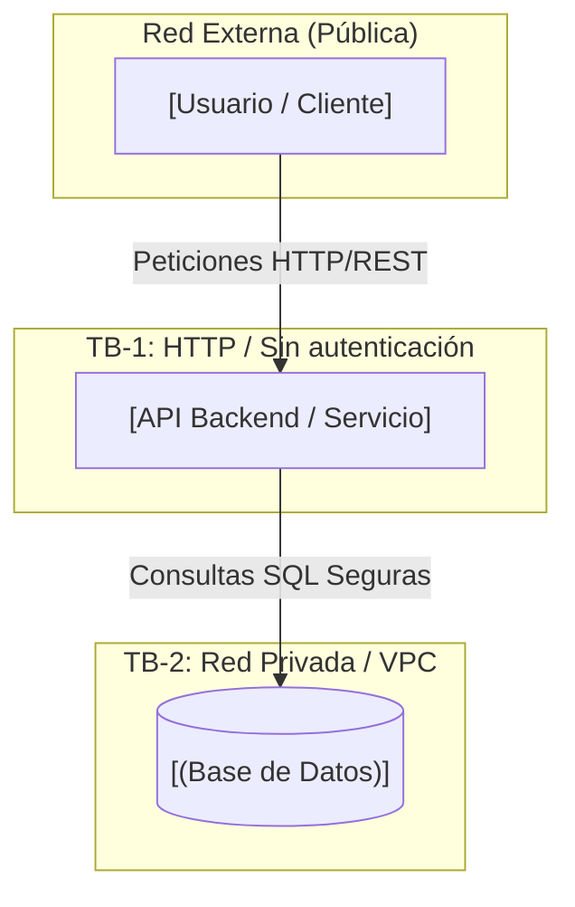

# Modelo de Amenazas (Threat Model) - DevSecOps I

**Materia:** DevSecOps I  
**Docente:** Dr. Luis Alberto Reyes Ibarra  
**Fecha:** Septiembre 2026  
**Versión:** 1.0  
**Metodología:** STRIDE  

---

## 1. Arquitectura del Sistema

El siguiente diagrama en **Mermaid.js** representa la arquitectura segura del sistema y sus fronteras de confianza (*Trust Boundaries*):

---

## 2. Definición de Fronteras de Confianza (Trust Boundaries)

* **TB-1 (Frontera Externa):** Separa a los usuarios públicos no confiables de la capa de API Backend. Requiere cifrado TLS/HTTPS y autenticación de tokens.
* **TB-2 (Frontera Interna):** Separa la API Backend de la Base de Datos. La Base de Datos se ubica en una red privada y **nunca debe ser accesible directamente desde Internet**.

---

## 3. Análisis de Amenazas (STRIDE)

| Categoria STRIDE | Amenaza Identificada | Impacto | Control / Mitigación Implementado |
|---|---|---|---|
| **Spoofing** | Suplantación de desarrolladores al subir código a la rama `main`. | Alto | Exigir **Signed Commits** (firmas GPG/SSH obligatorias) [Práctica 3]. |
| **Tampering** | Modificación maliciosa o impositiva de la arquitectura en `main`. | Crítico | Regla **Require a pull request before merging** con al menos 1 aprobación (Peer Review) [Práctica 3]. |
| **Tampering** | Exposición de la Base de Datos directamente a Internet (Bypass de la API). | Crítico | Validación del diagrama en Peer Review (Fase 2 de la práctica). |
| **Information Disclosure** | Exposición no autorizada de datos por falta de controles en la API. | Alto | Restricción de acceso directo a la BD únicamente desde la red interna de la API (TB-2). |
| **Elevation of Privilege** | Administradores saltándose las reglas de seguridad de las ramas. | Crítico | Activar opción **Do not allow bypassing the above settings** [Práctica 3]. |

---

## 4. Políticas de Seguridad e Integración Continua (Branch Protection)

Para garantizar la integridad de este Modelo de Amenazas y del código fuente, se aplican las siguientes reglas obligatorias en la rama `main`:

1. **Revisión de Pares Obligatoria:** Ningún cambio se integra a `main` sin un Pull Request aprobado por al menos 1 revisor.
2. **Firmado de Commits:** Todos los commits deben estar autenticados mediante llaves criptográficas.
3. **Validación de Integración (CI):** Chequeos de estado pasados antes de habilitar el botón de Merge.
4. **Sin Excepciones:** Las reglas aplican por igual a colaboradores y administradores del repositorio.
